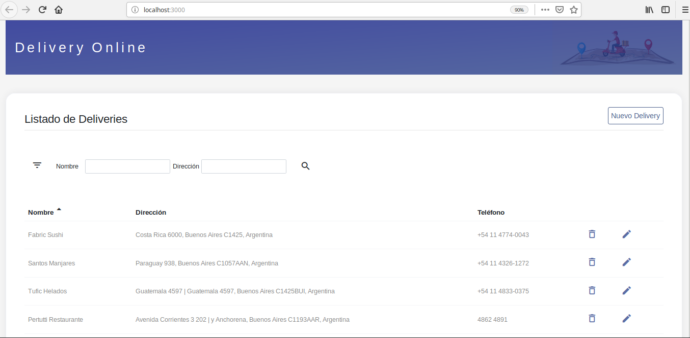

## Delivery

Web application to manage delivery for food houses.

The backend server is provided by json server module. The cool thing about this project is that it has form validations via react formsy library and a grid component completely built from the scratch.

Also there's a fancy documentation site that provides information about every component properties via docz package.

  

## How to run it ?

### `npm install` or `yarn install`

Install all the dependencies

### `npx json-server --watch db.json --port 5000`

Creates a new instance of json server

### `npm run start`

Runs the react application

### `yarn docz:dev `

Generates docs for all the components according to what's defined on the .mdx files.

